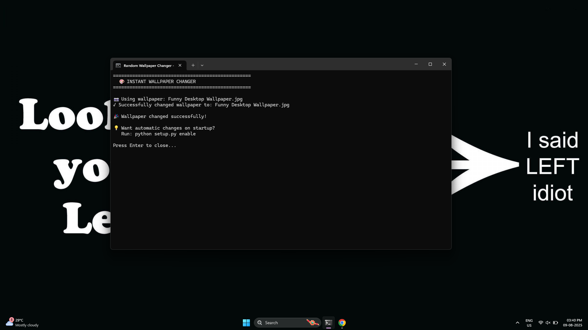

# Instant Wallpaper Changer 🎯


## Basic Details
### Team Name: Madhumith Prasanth


### Team Members
- Team Lead: Madhumith Prasanth - CUCEK

### Project Description
A completely invisible wallpaper changer designed for harmless pranks and silent demonstrations that operates with zero popup windows or detection. The system uses VBScript wrappers and Windows APIs to instantly change desktop wallpapers, install hidden startup scripts for persistent pranking, and ensure registry persistence across system reboots.

### The Problem (that doesn't exist)
People are getting way too comfortable with their boring desktop wallpapers and need immediate intervention. Friends' computers are suffering from chronic wallpaper monotony, and there's absolutely no way to secretly change them without triggering annoying popup windows that ruin the surprise!

### The Solution (that nobody asked for)
An ultra-sophisticated stealth wallpaper warfare system featuring VBScript ninjas, Python commandos, and Windows API wizardry! Deploy invisible wallpaper bombs with zero detection, install persistent prank modules that survive reboots, and watch victims question their sanity as their wallpapers mysteriously change. Because clearly, the world desperately needed a way to silently terrorize desktops with complete invisibility and maximum confusion!

## Technical Details
### Technologies/Components Used
For Software:
- **Python 3.x** - Core wallpaper manipulation engine
- **VBScript** - Silent execution wrappers for zero popup stealth
- **Windows Batch** - User-friendly interfaces and installation routines
- **Windows Registry API** - Persistent wallpaper settings across reboots
- **Windows SystemParametersInfo API** - Direct desktop wallpaper control
- **ctypes library** - Python-to-Windows API bridge
- **winreg module** - Registry manipulation for persistence
- **subprocess module** - Silent process execution with CREATE_NO_WINDOW

For Hardware:
- **Windows 10/11 Compatible PC** - Target system for stealth operations
- **Storage Device** - USB drive or network share for deployment
- **Keyboard & Mouse** - For the epic double-click stealth activation
- **Monitor** - To witness the magical wallpaper transformation

### Implementation
For Software:
# Installation
```bash
# Clone the stealth wallpaper warfare repository
git clone https://github.com/Madhuu06/useless2.0.git

# Navigate to the wallpaper script directory
cd "useless2.0/Wallpaper Script"

# Add your prank wallpapers to the wallpapers folder
# Supported formats: .jpg, .jpeg, .png, .bmp, .gif

# No additional dependencies required - uses built-in Windows APIs!
```

# Run
```bash
# 🥷 STEALTH MODE - Instant invisible wallpaper change
double-click CHANGE_WALLPAPER_SILENT.vbs

# 🎮 MANUAL MODE - Choose your options
double-click CLICK_ME_TO_CHANGE_WALLPAPER.bat

# 😈 PERSISTENT PRANK MODE - Install auto-startup
double-click CLICK_TO_INSTALL_STEALTH.vbs

# 🧹 CLEANUP MODE - Remove all traces
double-click STEALTH_REMOVE.bat
```

### Project Documentation
For Software:

# Screenshots (Add at least 3)

*Project file structure showing all stealth components and execution files*


*Demonstration of completely silent wallpaper change with zero popups*

### Project Demo
# Video


[

**Demo Explanation:** 
Upon running the script, the desktop wallpaper changes instantly to the wallpaper from the script. We demonstrate changing the wallpaper manually before restarting to verify the script's persistence across reboots. After boot-up, it takes roughly 15 seconds to load as the system services and startups initialize. The stealth script remains active until the user runs "STEALTH_REMOVE.bat" to completely uninstall it.

Made with ❤️ at TinkerHub Useless Projects 


